# UniVis

UniVis 是一个面向双臂具身操作的本地优先 Web 可视化、审查、标注与导出工具，核心思想是把不同来源的数据统一转换成内存中的同步轨迹 `PolicyEpisode`，再由同一套网页界面完成可视化、语言标注、质量审查和批量导出。

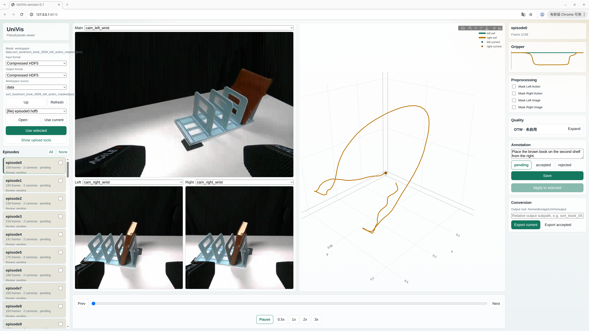

## 一、项目目标

UniVis 旨在可视化以及处理所有基于双臂 End Effector 的数据，任意输入格式的数据都应该能轻易地被添加到 UniVis 中并复用现成的可视化与处理 pipeline。目前支持的数据 pipeline 为：

1. 本体数据选择：选择一个本机数据目录。
2. 选择输入数据格式：如 PIKA raw、compressed HDF5、LeRobot v3。
3. 可视化数据检查：在网页中逐条查看图像、轨迹、夹爪状态，以及数据质量。
4. 数据语言标注：对于raw data，给 episode 写入语言标注、接受或拒绝审查结果。
5. 数据预处理：在导出时应用选中的数据预处理操作。
6. 数据格式转换：将任意一种 input 数据类型转换为任意一种 output 数据类型。

Version 0.1 假设 server 和 browser 运行在同一台机器上，因此使用 named workspace 共享本机目录，避免大规模上传原始图片或视频。

## 二、安装

UniVis使用 `uv` 进行高效的依赖管理。

首先，安装 `uv`:

```bash
curl -LsSf https://astral.sh/uv/install.sh | sh
```

随后，一键安装依赖:

```bash
uv sync --extra dev
```

## 三、启动

最常用的启动方式是同时配置输入 workspace 和导出 output root：

```bash
uv run univis \
  --port 8010 \
  --workspace raw=/path/to/rawdata \
  --workspace hdf5=/path/to/hdf5data \
  --output /path/to/output
```

启动后打开：

```text
http://127.0.0.1:8010
```

`--workspace NAME=PATH` 可以重复传入。`NAME` 会显示在网页的 Workspace source 下拉框中，`PATH` 是 server 端能直接访问的数据根目录。

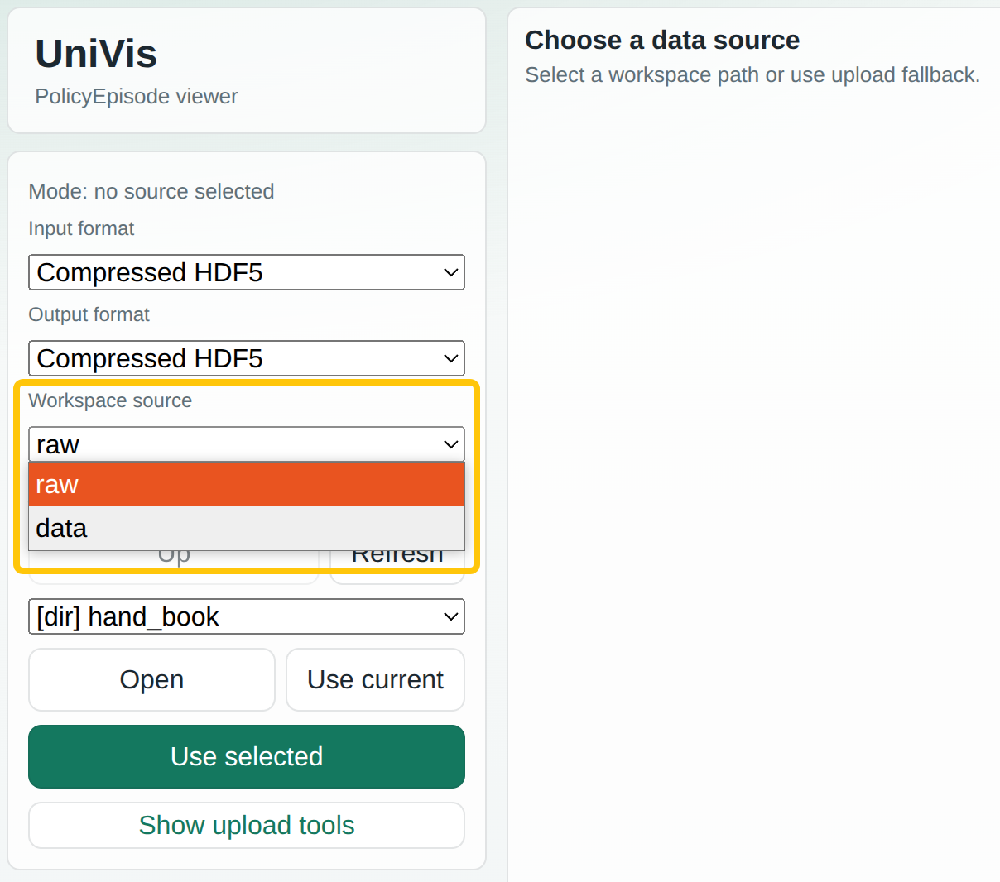

`--output PATH` 指定导出的根目录。网页里的输出路径输入框只填写这个根目录下的相对子路径，例如 `sort_book_0509/pos1`，最终会导出到 `/path/to/output/sort_book_0509/pos1`。

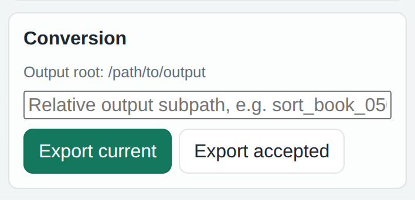

如果不指定 `--output`，默认导出到项目目录下的 `.univis/exports`。

## 四、基本使用方法

> version: 0.1.0

围绕可视化，UniVis有多种使用方法，下面给出几种经典用法。

### 4.1 PIKA数据实时采集与可视化

1. 启动 UniVis，将 workspace 之一设置为 PIKA 原始数据存放的目录，另一个 workspace 设置为 output 的目录，用于后续检查导出的 HDF5。

    ```
    uv run univis \
      --port 8010 \
      --workspace raw=/path/to/realtime/rawdata \
      --workspace output=/path/to/output \
      --output /path/to/output
    ```

2. 选择数据源

    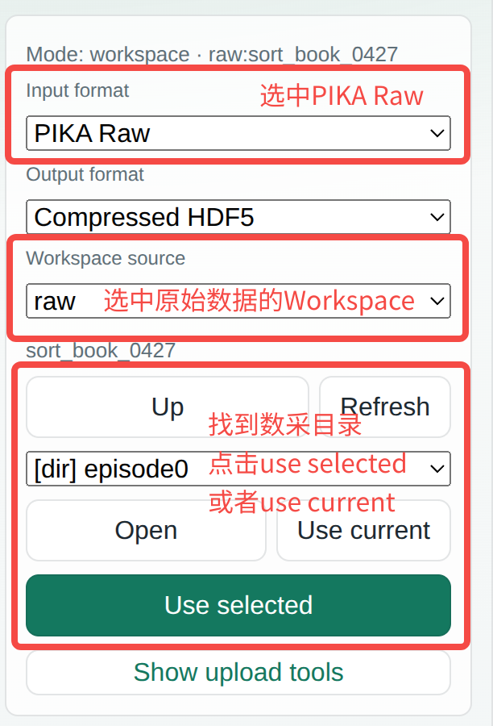


3. 选择需要查看的 Episode

    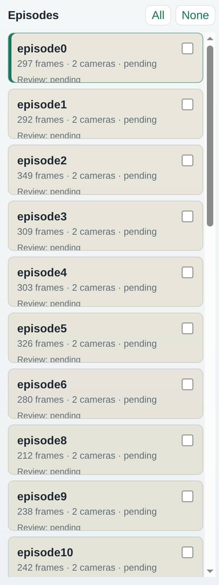

    点击 episode 右侧的单选框可以选中一条episode，可以用于后续的批量标注

4. 数据检查与导出

    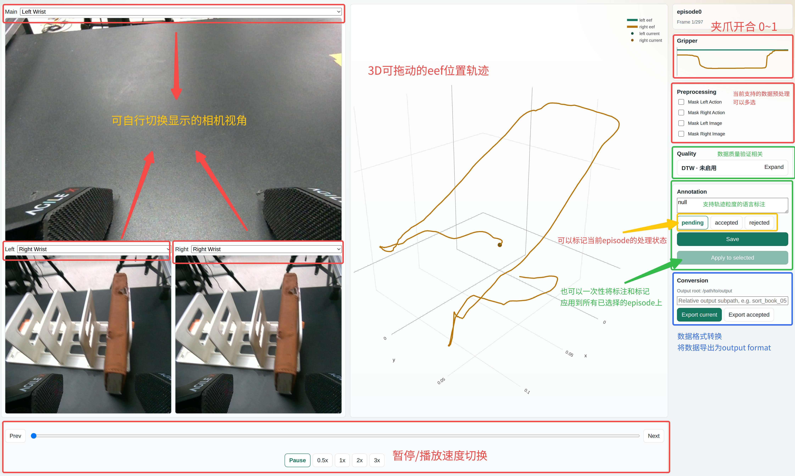

5. 随采随可视化

    点击Refresh，可以重新加载当前目录，看到最新采集的 episode。从而做到采集一条即可处理一条。

    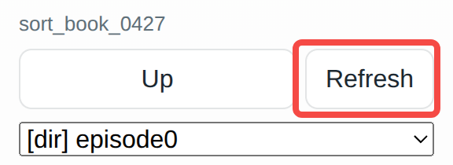

### 4.2 数据质量检测 —— Dynamic Time Warping (DTW)

在模仿学习中，我们通常会定义一条专家轨迹，我们希望每次采集的数据和专家轨迹比较相似。现在，我们可以在 UniVis 中轻松直观地看到 DTW 的结果。

1. 首先打开专家 episode

2. 点击 DTW 展开操作栏，选中 Enable DTW

    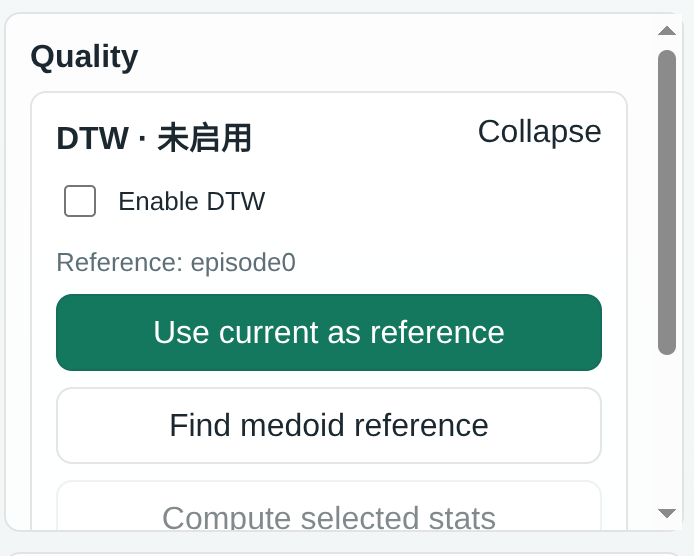

3. 然后选择当前 episode 作为 reference

    启动 dtw 后会弹出一个浮动窗口，展示 dtw 指标。

    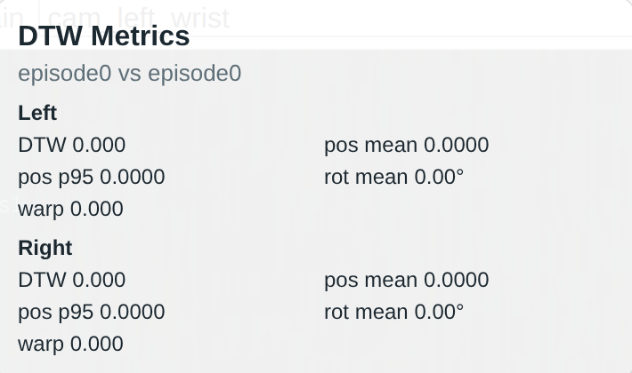

4. 切换episode，以进行dtw对比

    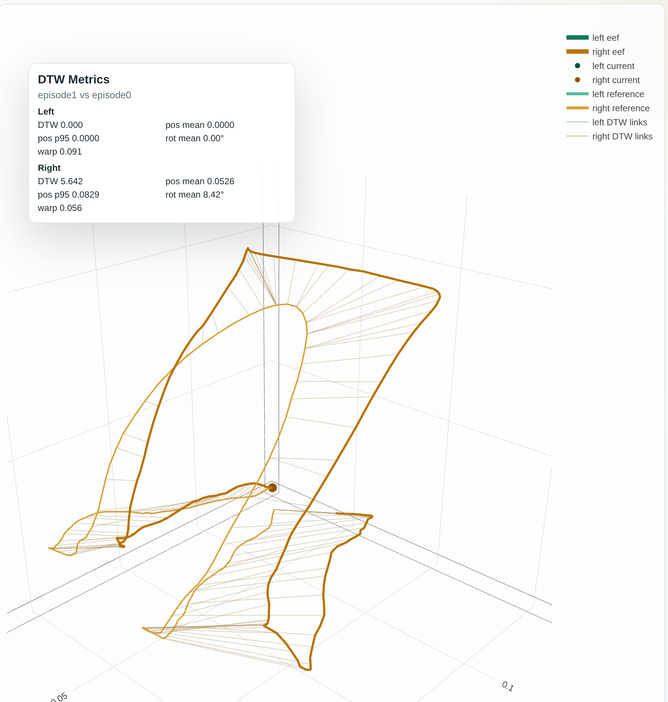

5. 导出统计结果

    从左侧 episode 处选中若干 episode，点击 Compute selected stats，便会计算出这样一张统计结果表


    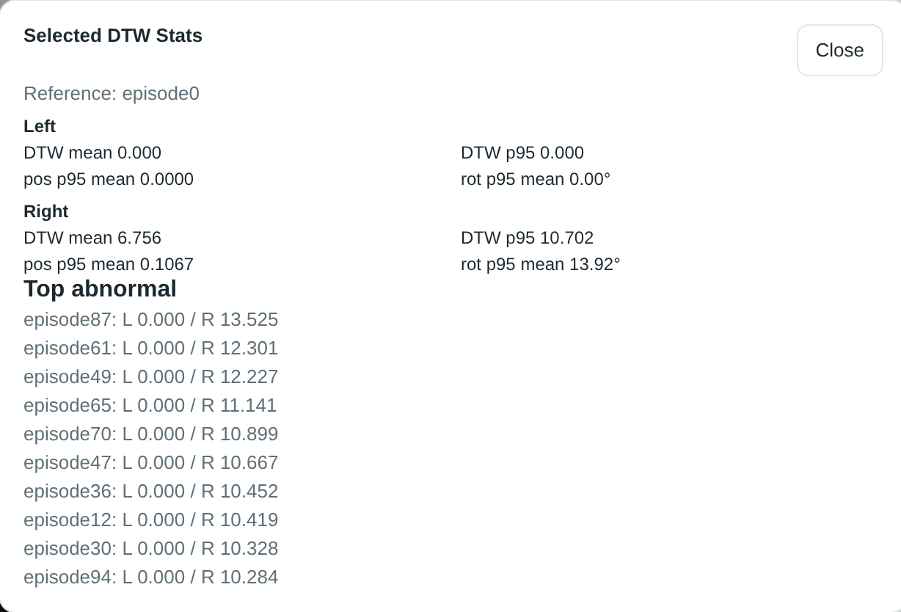

**进阶设置**:可以在 `UniVis/src/univis/quality/config/dtw/default.yaml` 中设置 dtw 参数

### 4.3 补充标注/补充后处理

UniVis 支持以 HDF5 格式为输入，并继续以 HDF5 格式输出，因此可以实现增量修改。使用方式和 4.1 基本一致，只需要将输入格式替换为 HDF5，并找到需要处理的 HDF5 目录即可。

## 测试

运行完整测试：

```bash
cd /home/dex/app/UniVis
PYTEST_DISABLE_PLUGIN_AUTOLOAD=1 uv run --extra dev pytest -q
```

检查前端脚本语法：

```bash
node --check src/univis/web/static/app.js
node --check src/univis/web/static/components.js
node --check src/univis/web/static/conversion_components.js
```

`PYTEST_DISABLE_PLUGIN_AUTOLOAD=1` 用于避免系统里的无关 pytest 插件影响当前项目。

## 可扩展性

UniVis 的扩展点尽量围绕抽象类组织：

- 新输入格式：实现一个新的 `RawEpisodeAdapter`，把自定义 raw data、HDF5、视频数据或其他基于 EEF pose 的数据映射成 `PolicyEpisode`。
- 新输出格式：实现一个新的 `EpisodeExporter`，把 `PolicyEpisode` 导出成 HDF5、LeRobot 或其他训练格式。
- 新预处理：实现 preprocessor，在导出前对 episode 或图像读取器做动作 masking、图像 masking、裁剪等处理。
- 新可达性后端：实现 `ReachabilityBackend`，可以先接 dexechain IK，未来再替换为独立 IK backend。

因此，长期目标是让 UniVis 逐渐成为独立于特定本体、特定框架的数据审查与转换工具。输入格式、导出格式、预处理和 IK 都可以作为插件式模块逐步替换，而网页交互层保持稳定。
