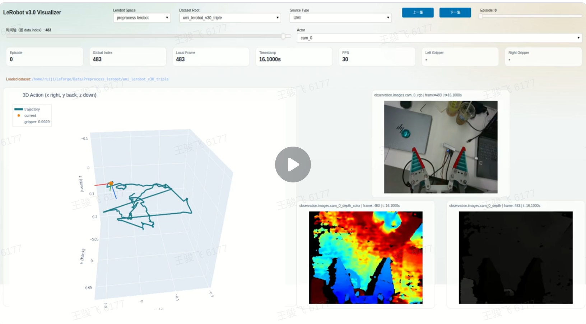

# Phase 00: Fake PolicyEpisode Web Viewer

## Goal

先做出一个可运行的 FastAPI + React 可视化界面，用 fake `PolicyEpisode` 验证核心交互和数据形态可行。这个阶段不接真实 HDF5、不接 PIKA raw、不接 IK，只证明“前端围绕 `PolicyEpisode` 可视化”这条路是通的。

## Scope

- 定义最小 `PolicyEpisode` mock schema。
- FastAPI 提供 fake episode 列表、metadata、frame、trajectory、gripper、annotation API。
- React 前端展示 episode 列表、可变相机画面、3D 轨迹、夹爪曲线、时间轴和基础标注区域。
- fake 图像可以用程序生成的彩色帧、文字帧或简单动态图。
- fake trajectory 必须符合“双臂 eef pose + gripper”的 action/state 约定。

## Acceptance

- 能通过一个命令启动后端和前端，浏览器中看到至少 2 条 fake episode。
- 相机数量是可变的，至少验证 1、2、4 个 camera stream 的布局。
- 时间轴拖动时，相机帧、左右臂轨迹当前点、夹爪值同步更新。
- 标注输入框可以编辑，并通过 API 保存到临时 annotation store。
- 前端所有可视化数据都来自 fake `PolicyEpisode` API，而不是写死在组件里。

## Tests

- 后端 smoke test：请求 episode list、metadata、trajectory、frame API 均返回 200。
- 前端手动验收：打开页面、切 episode、拖动时间轴、修改标注。
- 可选 Playwright 截图：确认页面非空、相机区域和轨迹区域存在。

## Out Of Scope

- 不接真实数据。
- 不导出 HDF5。
- 不运行 IK。
- 不做生产级 UI polish。

## 补充

- 整体ui布局参考LeForge
- 相机布局部分做适应性修改，推荐默认在上方的中间放置主目相机，下一行放置左右手腕部相机，用户可以自行切换每个位置播放哪个camera的图。
- 动作也参考LeForge，可以支持3D拖转旋转缩放